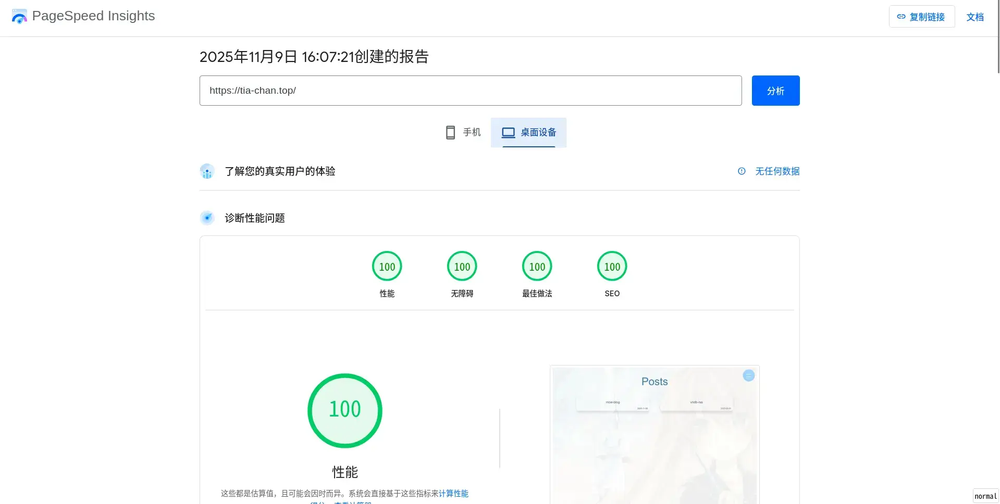
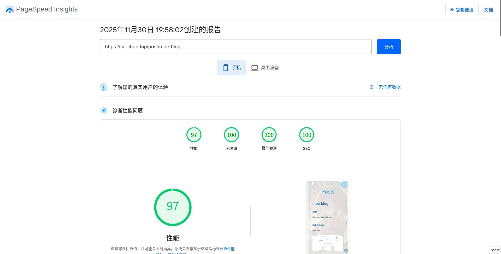
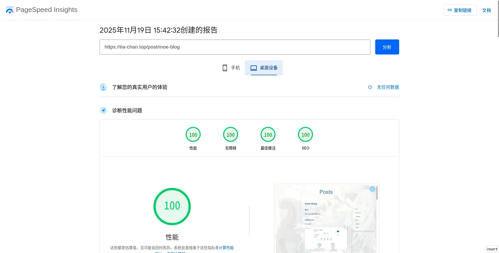

# moe-blog

## 简介

使用 nextjs 构建的萌萌 blog

## lighthouse

home page:

post page:

## 任务清单

- [x] 导航栏

- [x] 分页

- [x] markdown to html

- [x] 代码语法高亮/复制按钮

- [x] 文章侧边栏

- [x] RSS

- [x] VNDB 阅读列表

- [ ] 类似 Pixiv 的图片查看器(移动端)

- [ ] 搜索框

- [ ] 黑暗模式

- [ ] 评论功能 (打算使用 Postgres 作为数据库)

## 日志

- 2025-11-08 本来想使用 mdx 的，不过不支持直接导入相对路径的图片，暂且放弃，主要是因为在 markdown 文件中使用 import 有点麻烦，改天再试试，如果对 lighthouse 提升较大就使用

- 2025-11-09 切换到 mdx compiler 试试，顺便开启 GFM 插件

- 2025-11-09 测试了下性能果然提升了，毕竟 mdx 支持使用 Image 等组件嘛，与之相对的 marked 库只能转换 html，没有懒加载，自动设置尺寸等优化

- 2025-11-14 使用 VNDB-API 根据 User ID 获取投票前几的视觉小说，静态路由默认缓存图片和条目，这意味着仅请求一次，符合 [vndb-api](https://api.vndb.org/kana#usage-terms) 速率限制周期

- 2025-11-15 目前所有路由都为 SSG 渲染，之后的评论功能预计使用 ISR 渲染

- 之前为分页功能实现 SSG 思考了一段时间，首先排除使用 `searchParams props`，这会将路由变为动态的 SSR。其次排除使用 `useSearchParams hooks`，这会增加客户端包的体积并且数据离服务端近，如果使用 api-token 还会暴露。这样搜索参数就无法使用了，但可以改为路径，也就是使用 `params props` 获取路径的页码。但是又有个新问题，如果直接使用 `/[slug]` 获取页码，首页就需要重定向到 `/1`,这会影响 SEO 和加载速度，~~到这里思考停止了~~，直到查看[文档](https://nextjs.org/docs/app/api-reference/file-conventions/dynamic-routes#optional-catch-all-segments)无意间看到 `[[...slug]]` 的 slug 参数如果返回 undefined 会回到上一个路由段，也就是说我完全可以利用这个特性，而不是使用重定向，实现相同的效果，结合 `generateStaticParams()`，完美实现 SSG 渲染

## License

GNU AGPLv3
